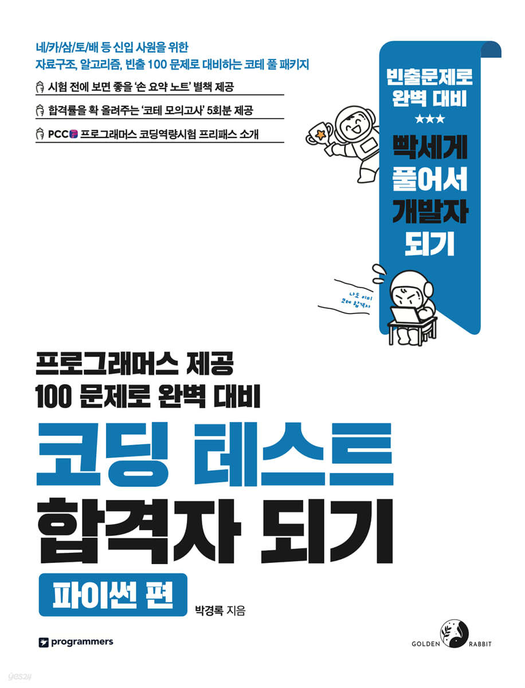
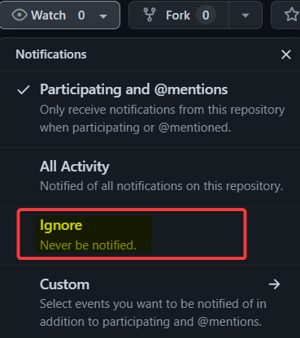
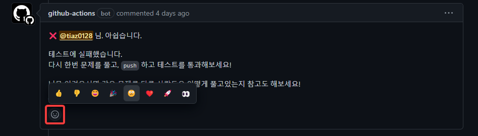
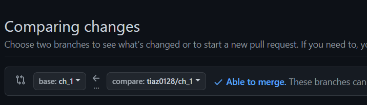
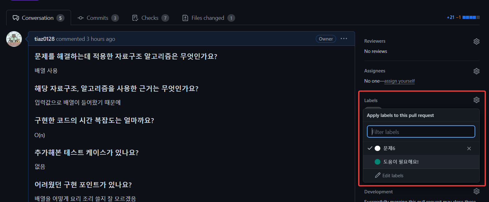
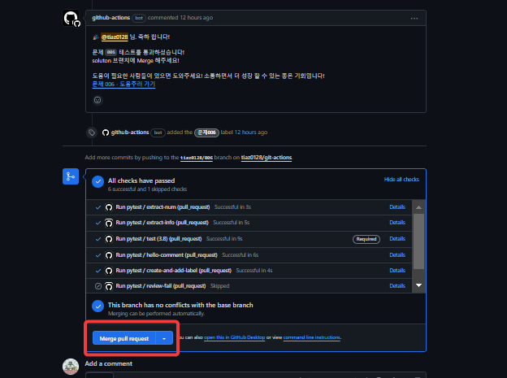

# ✨ 함께 공부하는 사람들 ✨
<details>
    <summary>문제 풀고 있는 사람들 보기</summary>

- 하루에 한번 문제 풀이 현황이 업데이트 됩니다.
- 한개 이상 문제를 Pass 하신 경우에 표시 됩니다.
- 많이 푸신 분 순서대로 표시됩니다.
- 모두 85개 + 15개 푸실때 까지 화이팅입니다!

<!-- PR Status Start -->

<table style="border: 2px solid black; width: 100%; border-collapse: collapse"><tr><td style="text-align: center; vertical-align: middle; padding: 20px"><div><p align="center">🍀 34 / 85</p></div><div><p align="center"></p></div><div><p align="center">youngrongoh</p></div><div><p align="center"><a href=https://github.com/to-be-pass/python-coding-test/pulls?q=is%3Apr+author%3Ayoungrongoh+assignee%3Ayoungrongoh>풀이 보러가기</a></p></div></td><td style="text-align: center; vertical-align: middle; padding: 20px"><div><p align="center">🍀 31 / 85</p></div><div><p align="center"></p></div><div><p align="center">tiaz0128</p></div><div><p align="center"><a href=https://github.com/to-be-pass/python-coding-test/pulls?q=is%3Apr+author%3Atiaz0128+assignee%3Atiaz0128>풀이 보러가기</a></p></div></td><td style="text-align: center; vertical-align: middle; padding: 20px"><div><p align="center">🍀 5 / 85</p></div><div><p align="center"></p></div><div><p align="center">BGM-109</p></div><div><p align="center"><a href=https://github.com/to-be-pass/python-coding-test/pulls?q=is%3Apr+author%3ABGM-109+assignee%3ABGM-109>풀이 보러가기</a></p></div></td><td style="text-align: center; vertical-align: middle; padding: 20px"><div><p align="center">🍀 5 / 85</p></div><div><p align="center"></p></div><div><p align="center">Messe7654</p></div><div><p align="center"><a href=https://github.com/to-be-pass/python-coding-test/pulls?q=is%3Apr+author%3AMesse7654+assignee%3AMesse7654>풀이 보러가기</a></p></div></td><td style="text-align: center; vertical-align: middle; padding: 20px"><div><p align="center">🍀 2 / 85</p></div><div><p align="center"></p></div><div><p align="center">dayaelee</p></div><div><p align="center"><a href=https://github.com/to-be-pass/python-coding-test/pulls?q=is%3Apr+author%3Adayaelee+assignee%3Adayaelee>풀이 보러가기</a></p></div></td></tr><tr><td style="text-align: center; vertical-align: middle; padding: 20px"><div><p align="center">🍀 1 / 85</p></div><div><p align="center"></p></div><div><p align="center">kshjessica</p></div><div><p align="center"><a href=https://github.com/to-be-pass/python-coding-test/pulls?q=is%3Apr+author%3Akshjessica+assignee%3Akshjessica>풀이 보러가기</a></p></div></td></tr>
</table>

<!-- PR Status End -->

</details>

<br/>

# TO-BE 저장소로 공부하는 방법

> ✨이 저장소는 '코딩 테스트 합격자 되기(파이썬 편)' 을 연습 할 수 있는 저장소입니다. <br/>

[책 공식 저장소](https://github.com/dremdeveloper/codingtest_python)

<br/>

❓ 내가 풀었던 문제를 다시봐도 어떻게 풀었는지 기억나지 않나요? <br/>
❓ 문제는 사이트에서 풀고, 정리는 블로그에 하고? 뭔가 비효율적이지 않았나요? <br/>
❓ 같은 문제를 푼 사람의 코드를 봐도, 왜 이렇게 풀었는지 알고 싶지 않나요? <br/>
❓ 잘 풀리지 않는 문제는 조금의 도움을 받고 싶지 않았나요? <br/>

<br/>

<div align=center>
    
</div>

<br/>

## 😊 저장소 특징

### 1. 누구나 사용가능 하다.

✅ 해당 저장소는 책을 공부하는 누구나 사용할 수 있는 공간입니다. <br/>
✅ 아무런 조건도 제약도 없는 자유로운 저장소입니다. <br/>
✅ 책을 혼자 공부하시는 분들, 책을 스터디 중인 분들도 저장소를 활용해보세요! <br/>

<br/>

### 2. 문제를 풀면서 정리하고 과정까지 기록 할 수 있다.

✅ 문제를 하나씩 풀고 제공된 탬플릿으로 스스로 문제를 하나씩 정리 할 수 있습니다. <br/>
✅ 풀어가는 과정을 커밋과 코멘트를 달면서 기록 할수 있습니다. <br/>
✅ 나와 같은 문제를 다른 사람은 어떤 생각으로 풀었는지 찾아 볼 수 있습니다.<br/>
✅ 문제를 풀다가 어려우면 도움을 요청해보세요! <br/>

<br/>

### 3. 디버깅으로 공부 해보자!

✅ 로컬에서 디버깅 하면서 공부할 수 있습니다. <br/>
✅ `PR`(Pull Request)를 작성하면 자동으로 테스트가 동작합니다. <br/>

<br/>

## 🔥 저장소 유의사항

- 테스트에 사용하는 파이썬 버전은 프로그래머스와 동일한 `python 3.8` 버전입니다.
- 아래의 설명을 보면서 따라해봅시다.
- 반드시 정해진 규칙에 따라서 `경로`, `파일명` 및 `함수명`을 작성해야 제대로 테스트가 동작합니다.
- ✨ 브랜치에 사용되는 숫자는 반드시 3자리로 빈자리는 0으로 채워야 합니다! ex) `001`, `010`, `900`
- 아이디는 깃허브 아이디를 의미합니다.

<br/>

## 서로서로 리뷰해 보자

- 나랑 같은 문제를 다른 사람이 어떻게 풀었는지 참고해보세요!
- 도움이 됐다면 코맨트나 이모티콘으로 감사를 표현해보세요!
- 서로 소통해 보세요! 더 많이 배우고 느낄 수 있습니다!

<br/>

## 알람 끄기

- 기본적으로 테스트 대한 알람과 이메일이 갑니다.
- 자주 알람이 오거나 필요없는 경우에는 해제하시면 됩니다.
- 해당 저장소 화면 오른쪽 상단에 `Notifications`을 `watch`에서 `Ignore`로 변경해주세요.



<br/>

## tests 폴더

- 🔥 테스트를 추가하거나 변경하고 싶은 경우 따라하시면 됩니다.
- 기본이 되는 베이스를 완성해놨습니다.
- 추가로 작성하는 테스트는 테스트가 유효한 경우에만 동작하게 만들어져있습니다.
- `git rm` 명령어로 commit 대상에서 tests 폴더를 제외합니다.
- 더 이상 tests 폴더의 변경 사항은 포함되지 않습니다.
- 이제 마음껏 테스트를 추가 하면서 공부해 보세요!

```bash
$ git rm --cached tests
```

<br/>

## 코드 자동 완성 끄기

- 🔥 실제 코딩 테스트 환경처럼 자동 완성 없이 해보고 싶은 분만 따라 하세요!
- 최상단 경로 `.vscode` 폴더를 생성합니다.
- 폴더 안에 `settings.json` 파일을 만들고 아래의 설정을 추가합니다.
- `.vscode/settings.json` 파일에 아래의 내용이 있으면 제대로 설정됐습니다!

<details>
    <summary>settings.json 설정값 자세히</summary>

<!-- summary 아래 한칸 공백 두고 내용 삽입 -->
```json
{
  "explorer.compactFolders": false,
  "explorer.confirmDragAndDrop": false,
  "editor.suggest.showConstants": false,
  "editor.suggest.showConstructors": false,
  "editor.suggest.showCustomcolors": false,
  "editor.suggest.showDeprecated": false,
  "editor.suggest.showEnumMembers": false,
  "editor.suggest.showEnums": false,
  "editor.suggest.showEvents": false,
  "editor.suggest.showFields": false,
  "editor.suggest.showFiles": false,
  "editor.suggest.showFolders": false,
  "editor.suggest.showFunctions": false,
  "editor.suggest.showInterfaces": false,
  "editor.suggest.showIssues": false,
  "editor.suggest.showKeywords": false,
  "editor.suggest.showMethods": false,
  "editor.suggest.showModules": false,
  "editor.suggest.showOperators": false,
  "editor.suggest.showProperties": false,
  "editor.suggest.showReferences": false,
  "editor.suggest.showSnippets": false,
  "editor.suggest.showStructs": false,
  "editor.suggest.showTypeParameters": false,
  "editor.suggest.showUnits": false,
  "editor.suggest.showUsers": false,
  "editor.suggest.showValues": false,
  "editor.suggest.showVariables": false,
  "editor.suggest.showWords": false,
  "editor.suggest.showClasses": false,
  "editor.suggest.showColors": false
}
```

</details>


<br/>

## solutions 폴더

- 문제와 매칭되는 정답을 적는 폴더 파일 구성 및 매개변수를 받아오는 함수를 미리 만들어 두었습니다.
- 문제를 풀기 시작 할때 해당하는 폴더와 파일을 가져와서 사용하시면 됩니다.

<br/>

## PR 코멘트 정리하기



- 매시간 마다 자신의 PR 중에서 😕 리액션이 붙은 코멘트는 삭제됩니다.
- 깃허브 봇이 작성한 코멘트도 정리 가능합니다.
- 필요 없는 PR 코멘트는 정리하세요!

<br/>

# ✨ 여기서 부터 해당 저장소를 사용하는 방법입니다.

## 시작 앞서 드리는 말씀

1. 깃허브 사용에 익숙하지 않으시거나
2. 해당 저장소를 활용한 스터디 활용 방안
3. 저장소에 사용 방법에 대한 문의 ex) 로컬에서 디버깅 방법
4. 추가 해줬으면 기능, 개선 했으면 기능

아래 적혀 있는 단톡방이나 디스코드 채널 통해
편하게 말씀 해주시면 최대한 도움을 드리겠습니다.

감사합니다.

<br/>

## 0. 참여 방법

1. 책 저자님이 직접 운영하시는 소통 채널로 입장해주세요.
2. '통붕이' 또는 'tiaz0128' 또는 'TO-BE 저장소' 참여하고 싶다고 알려주세요.
3. 참여 의사가 있으신 분은 깃허브 아이디를 알려주세요.
4. 저장소 초대 메일이 가면 승인해주세요.

| 채널 | 링크 |
|----------|----------|
| 카카오톡 단톡방 | [링크](https://open.kakao.com/o/gX0WnTCf) |
| 디스코드 | [링크](https://discord.gg/3AfpGcTWr5) |

<br/>

## 1. git clone

- 깃 clone부터 시작하시면 됩니다!

```shell
git clone https://github.com/to-be-pass/to-be-pass-python-coding-test.git
```

<br/>

## 2. 브랜치 생성

1. `solutions` 브랜치로 `checkout`합니다.
2. `solutions` 브랜치에서 다시 `아이디/문제번호`로 생성합니다.
3. 여기서 생성한 브랜치 번호가 테스트가 실행되는 문제번호 입니다.
4. ✨ 숫자는 반드시 3자리로 빈자리는 0으로 채워야 합니다!

- ex) `tiaz0128/001` 1번 문제만 테스트 합니다.
- ex) 001, 010, 900

```shell
git checkout -t origin/solutions

git checkout -b 아이디/문제번호
```

<br/>

## 3. solution 파일 생성

1. `src/아이디` 경로 아래에 해당 챕터 폴더를 넣어줘야 합니다. 넣는 방법은 간단합니다.
2. `solutions`에 각 챕터별로 파일과 함수가 미리 만들어져 있습니다.
3. `src/아이디/해당챕터` 를 만들고 `solution_문제번호.py` 파일을 복사해서 넣으세요!
4. `src/아이디/해당챕터/solution_문제번호.py` 세팅됐다면 제대로 하셨습니다!

<br/>

## 4. solution 함수 작성

1. 문제 번호에 맞는 정답 함수를 조금전 세팅했던 `solution_문제번호.py` 파일에 작성합니다.
2. 함수명은 `solution`입니다.
3. 프로그래머스와 동일하게 정답을 리턴하는 함수를 작성합니다.

<br/>

## 5-1. 로컬에서 pytest 로 확인

1. `pytest`, `python-dotenv`를 설치합니다.
2. /to-be-pass-python-coding-test 폴더로 이동합니다. (/ch_0*와 같은 폴더에서는 오류가 발생합니다.)
3. 아래의 명령어로 `pytest`를 실행합니다.
4. 실행 옵션은 자신의 아이디 와 해당 챕터입니다.
5. 특정 문제만 테스트 할 수도 있습니다.

```shell
pip install pytest python-dotenv

# 챕터 전체 문제 test 
pytest --id=아이디 -m ch_챕터번호

# 특정 문제만 test
pytest --id=아이디 -k 'test_001'
```

🔥 테스트 코드를 추가 싶으신 경우 아래의 명령어를 입력해주세요
```bash
$ git rm --cached tests
```

<br/>

## 5-2. 로컬 디버깅 하기

- 디버깅하면서 공부해보세요! 엄청 도움이 됩니다!
- 로컬에서 자신이 작성 코드를 테스트 하고 싶은 경우 파일을 수정해야 합니다.
- `./tests/.env` 파일에 자신의 아이디값을 넣어줍니다.
- 다른 사람의 깃허브 아이디를 넣고 확인해 볼 수도 있습니다.
- 🔥 단, 현재 브랜치에 해당하는 아이디의 폴더와 코드가 있어야 합니다.
- 저저님 아이디 `dremdeveloper`를 세팅하면 전체 테스트를 통과하는 것을 확인해보세요!
- 테스트가 제대로 동작하지 않는 것 같아요! -> tests/.env 파일과 폴더 파일명 함수 인자값 등을 꼭 확인해주세요.

```text
USER_ID=아이디
```

<br/>

## 6. 브랜치 push

- 브랜치명이 `아이디/문제번호` 인지 확인하고 `push`합니다.

```shell
git push origin 아이디/문제번호
```

<br/>

## 7. ✨ 깃허브 PR(Pull Request) 생성 ✨



- PR 을 작성하면 문제에 대해서 기록을 남길수 있는 탬플릿이 제공 됩니다!
- 풀지 못한 문제도 PR 을 남기고 스스로 코멘트를 달아가면서 풀어가는 과정까지 기록 해보세요!
- `solutions`를 base로 지정하고 `아이디/문제번호` 를 compare 브랜치로 지정합니다.
- PR 작성하면 자동으로 테스트가 동작하고 정답을 확인합니다.

<br/>

## 8-1. PR 테스트 실패 시

- PR 생성 후 `push`할 때마다 테스트가 동작합니다.
- 어디서 어떤 값때문에 실패했는지 로컬에서 디버깅 해보고 스스로 코멘트를 남겨봅시다!
- 도움이 필요하면 라벨을 붙여서 다들 사람에게 도움을 요청해 보세요!



<br/>

## 8-2. PR 테스트 성공 시 : Merge 하기



- 테스트를 통과하면 깃허브에서 `solutions` 브랜치에 `merge`합니다.
- `Merge pull request` 버튼을 클릭 하면 됩니다!
- 같은 문제를 다른 사람은 어떻게 풀었는지 공부해보세요!
- 다른 사람의 코드를 보면서 이해가 가지 않는 부분에 코멘트를 남겨서 질문도 해보세요!
- `solutions` 브랜치에 `merge`하신 내용은 `main` 브랜치에 병합 해드립니다!

<br/>

## 9. 다음 문제로
- 다음 문제도 다시 `solutions` 브랜치로 돌가아서 하시면 됩니다!
- 제일 처음 `solutions` 브랜치를 `-t` 옵션으로 만들었으니 바로 `checkout` 하면 됩니다!
- 업데이트가 있을지 모르니 다음 문제를 풀기전 `pull` 하세요!

```bash
$ git checkout solutions

$ git pull origin solutions

$ git checkout -b 아이디/다음문제
```

<br/>

## 끝으로

문제를 푸는 것에서 끝나지 않고 커밋으로 기록하고 다시 회고해보세요! <br/>
해당 저장소는 PR이 모이면 모일수록! 서로 함께하면 할 수록! <br/>
개발자로써  더욱 성장할 수 있습니다! <br/>

감사합니다. 😊
