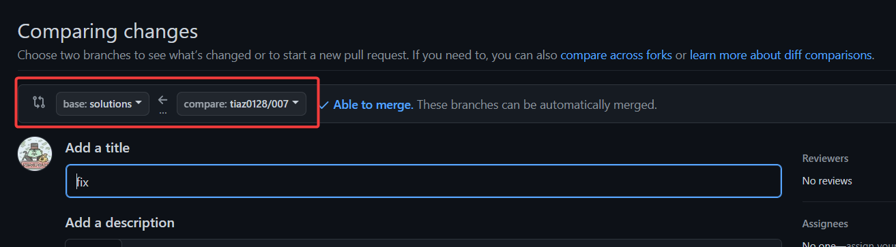

# TO-BE 저장소로 공부하는 방법

> ✨이 저장소는 '코딩 테스트 합격자 되기(파이썬 편)' 을 연습 할 수 있는 저장소입니다. <br/>

<br/>
<br/>

<div align=center>
    
</div>

<br/>

## 😊 저장소 특징

> ✅ 해당 저장소는 책을 공부하는 누구나 사용할 수 있는 공간 입니다. <br/>
> ✅ 아무런 조건도 제약도 없는 자유로운 저장소 입니다. <br/>
> ✅ 책을 혼자 공부하시는 분들, 책을 스터디 중인 분들도 저장소를 활용해보세요! <br/>
> ✅ 로컬에서 디버깅 하면서 공부 할 수 있습니다. <br/>
> ✅ `PR` (Pull Request) 를 작성하면 자동으로 테스트가 동작합니다. <br/>
> ✅ 서로의 코드를 보면서 피드벡을 하면 더 많이 느끼고 배울 수 있습니다. <br/>

<br/>

## 🔥 저장소 유의사항

- 테스트에 사용하는 파이썬 버젼은 프로그래머스와 동일한 `python 3.8` 버젼입니다.
- 아래의 설명을 보면서 따라해 봅시다.
- 반드시 정해진 규칙에 따라서 `경로`, `파일 명` 및 `함수 명`을 작성해야 제대로 테스트가 동작합니다.
- 아이디는 깃허브 아이디를 의미합니다.

<br/>

## 서로서로 리뷰해 보자

- PR 을 생성하면 자동으로 리뷰어로 등록 된 사람 중 한명이 리뷰어로 선택됩니다.
- 리뷰어로 활동하고 싶으신 분은 따로 알려주세요!
- 리뷰어가 리뷰를 남기는 활동도 100% 자유입니다. 리뷰를 하면 좋고 아니여도 좋습니다. 리뷰어 활동에 부담 갖지마세요!
- 따로 스터디에 참여 중인 분들은 직접 스터디원을 선택하고 서로 리뷰를 해보세요!
- 다른 사람의 PR 을 보면서 공부하고 리뷰어가 아니여도 리뷰를 남겨보세요!
- 서로 소통해 보세요! 더 많이 배우고 느낄 수 있습니다!

<br/>

## 알람 끄기

- 기본적으로 테스트 수행에 대한 알람이 이메일이 갑니다.
- 자주 알람이 오거나 필요없는 경우에는 해제 하시면 됩니다.
- 해당 저장소 화면 오른쪽 상단에 `Notifications` 을 `watch` 에서 `Ignore` 로 변경 해주세요.


<br/>

## tests 폴더

- 기본이 되는 베이스를 완성해놨습니다.
- 테스트를 추가 하면서 공부해 보세요.

<br/>

## solutions 폴더

- 문제와 매칭되는 정답을 적는 폴더 파일 구성 및 매개변수를 받아 오는 함수를 미리 만들어 두었습니다.
- 챕터별 문제를 풀기 시작 할때 해당하는 챕터 폴더를 가져와서 사용 하시면 됩니다.

<br/>

# ✨ 여기서 부터 해당 저장소를 사용하는 방법입니다.

## 시작 앞서 드리는 말씀

1. 깃허브 사용에 익숙하지 않으시거나
2. 해당 저장소를 활용한 스터디 활용 방안
3. 저장소에 사용방법에 대한 문의 ex) 로컬에서 디버깅 방법
4. 추가 해줬으면 기능, 개선 했으면 기능

아래 적혀 있는 단톡방이나 디스코드 채널 통해
편하게 말씀 해주시면 최대한 도움을 드리겠습니다.

감사합니다.

<br/>

## 0. 참여 방법

1. 책 저자님이 직접 운영하시는 소통 채널로 입장해주세요.
2. '통붕이' 또는 'tiaz0128' 또는 'TO-BE 저장소' 참여하고 싶다고 알려주세요.
3. 참여 의사가 있으신 분은 깃허브 아이디를 알려주세요.
4. 저장소 초대 메일이 가면 승인해주세요.

| 채널 | 링크 |
|----------|----------|
| 카카오톡 단톡방 | [링크](https://open.kakao.com/o/gX0WnTCf) |
| 디스코드 | [링크](https://discord.gg/3AfpGcTWr5) |

<br/>

## 1. git clone

- 깃 clone 부터 시작하시면 됩니다!

```shell
git clone https://github.com/to-be-pass/to-be-pass-python-coding-test.git
```

<br/>

## 2. 챕터 깃 브랜치 생성

1. 해당 챕터 브랜치로 `checkout` 합니다.
2. 브랜치 명은 `아이디/ch_번호` 로 생성합니다.

```shell
git checkout -t origin/ch_번호

git checkout -b 아이디/ch_번호
```

<br/>

## 3. solution 파일 생성 

1. `src/아이디` 경로 아래에 해당 챕터 폴더를 넣어줘야 합니다. 넣는 방법은 간단 합니다.
2. `/solutions` 에 각 챕터별로 파일과 함수를 미리 만들어져 있습니다.
3. `/solutions/해당챕터` 를 폴더 째 복사해서 넣어주시면 됩니다
4. `src/아이디/해당챕터` 에 폴더와 각 문제 파일이 존재하면 제대로 하셨습니다!

<br/>

## 4. solution 함수 작성

0. 문제 번호에 맞는 정답 함수를 `test_문제번호` 파일에 작성합니다.
1. 함수 명은 `solution` 입니다.
2. 프로그래머스와 동일하게 정답을 리턴하는 함수를 작성합니다.

<br/>

## 5-1. 로컬에서 pytest 로 확인

1. `pytest`, `python-dotenv` 를 설치합니다.
2. 아래의 명령어로 `pytest` 를 실행합니다.
3. 실행 옵션은 자신의 아이디 와 해당 챕터 입니다.
4. 특정 문제만 테스트 할 수도 있습니다.

```shell
pip install pytest python-dotenv

# 챕터 전체 문제 test 
pytest --id=아이디 -m ch_챕터번호

# 특정 문제만 test
pytest --id=아이디 -k 'test_문제번호'
```

<br/>

## 5-2. 로컬 디버깅 하기

- 디버깅하면서 공부해보세요! 엄청 도움이 됩니다!
- 로컬에서 자신이 작성 코드를 테스트 하고 싶은 경우 파일을 수정해야 합니다.
- `./tests/.env` 파일에 자신의 아이디값을 넣어줍니다.
- 다른 사람의 깃허브 아이디를 넣고 확인해 볼수도 있습니다.
- 🔥 단, 현재 브랜치에 해당하는 아이디의 폴더와 코드가 있어야 합니다.
- 저저님 아이디 `dremdeveloper` 를 세팅하면 전체 테스트를 통과하는 것을 확인 해보세요!
- 테스트가 제대로 동작하지 않는것 같아요! -> tests/.env 파일과 폴더 파일명 함수 인자값 등을 꼭 확인해주세요

```text
USER_ID=아이디
```

<br/>

## 6. 브랜치 push

- 브랜치 명은 `아이디/ch_번호` 로 생성해서 `push` 합니다.

```shell
git push origin 아이디/ch_번호
```

<br/>

## 7. 깃허브 PR(Pull Request) 생성



- PR 을 생성 합니다.
- `ch_번호` 를 base 로 지정하고 `아이디/ch_번호` 를 compare 브랜치로 지정합니다.
- 깃허브에서 PR 작성하면 자동으로 테스트가 동작하고 정답을 확인합니다.

<br/>

## 8-1. PR 테스트 실패 시

- PR 생성 후 `push` 할때마다 테스트가 동작합니다.
- PR 에서는 해당 챕터의 전체 문제를 테스트 합니다.
- 마지막까지 더 이상 문제를 풀지 못한 경우에는 강제로 `merge` 해줍니다.


<br/>

## 8-2. PR 테스트 성공 시

- 테스트를 통과하면 `merge` 합니다.
- 각 챕터 브랜치에 `merge` 하신 내용은 main 브랜치에 병합 해드립니다.
- 시간이 있으면 다른 사람의 PR 을 보면서 공부하고 서로 소통해 보세요!

<br/>
